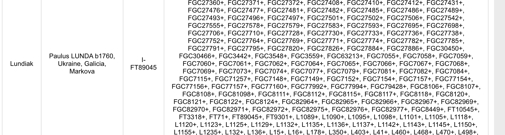

# DNA scripts

Various DNA scripts, which I need for my genetics research.

## ReFormat SNPs

This is a script to re-format SNP Results from downloaded `*.CSV` from FamilyTreeDNA My Y-DNA Haplotree to simplified `*.TXT` file of same format as it is shown on FamilyTreeDNA Y-DNA SNP public results page.

FamilyTreeDNA offers to download CSV file of SNP Results on [My Y-DNA Haplotree](https://www.familytreedna.com/my/y-dna-haplotree) page.


And on [Morley SNP predictor](https://ytree.morleydna.com/) it is expected different format - FamilyTreeDNA format, eg. `M343+, L21+, DF13+, DF23+, M222-`.


So I created script to re-format SNPs, so let it be here.

```sh
npm run reformatSNPs
```

And then in local `files` folder new `*.txt` file will be created, with "comma-separated list of SNPs".

Actually, I forgot that FamilyTreeDNA does have such format but on Groups/Projects pages, like [this](https://www.familytreedna.com/public/I2aHapGroup?iframe=ysnp). Example:



So my script provides identical result.

Also, this code is kinda aimed to have a place where I can update CSV file and see git diff among old and new SNPs.

## STR compare

In my Y-DNA research I frequently have a need to compare STR results for some or many men samples from FamilyTreeDNA [Y-DNA public page](https://www.familytreedna.com/public/I2aHapGroup?iframe=ydna-results-overview) where results are exposed in `TSV` format.

So, after `cd STR_compare` I run `npm start` and it compares `*.tsv` file I created in `data` folder, giving me result like this:


Script does NOT need the STR names as it shown on page table header. Script simply compares values positionally (from left to right).

- First value → first marker (`DYS393`)
- Second value → second marker (`DYS390`)
- and so on
