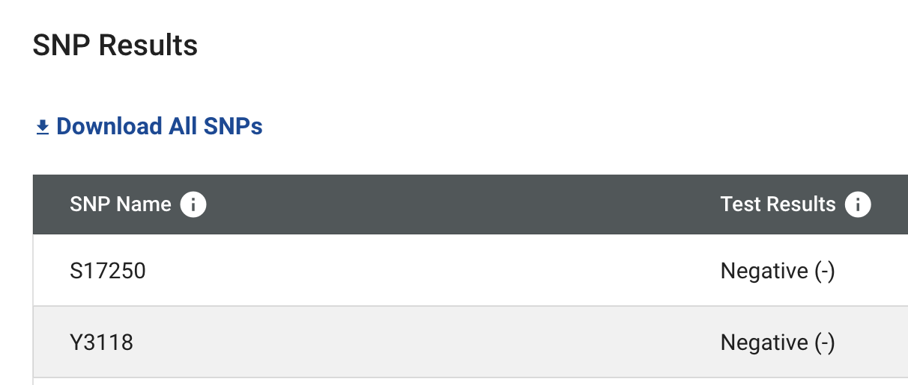
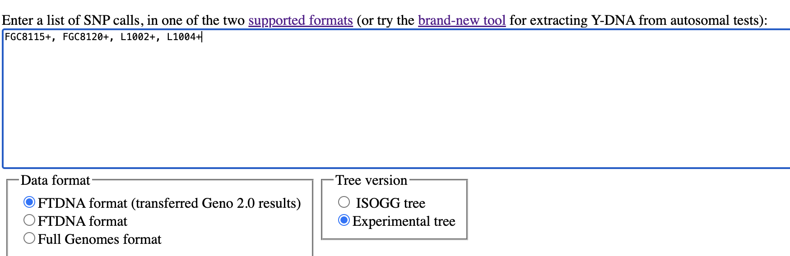

# DNA scripts

## ReFormat SNPs

FTDNA offers to download CSV file of SNP Results on [My Y-DNA Haplotree](https://www.familytreedna.com/my/y-dna-haplotree) page.




And on [Morley SNP predictor](https://ytree.morleydna.com/) it is expected different format - FTDNA format, eg. `M343+, L21+, DF13+, DF23+, M222-`.



So I created script to re-format SNPs, so let it be here.

```sh
npm run reformatSNPs
```

And then in local `files` folder new `*.txt` file will be created, with "comma-separated list of SNPs".

Actually, I forgot that FTDNA does have such format but on Groups/Projects pages, like [this](https://www.familytreedna.com/public/I2aHapGroup?iframe=ysnp). Example:


So my script provides identical result.

Also, this code is kinda aimed to have a place where I can update CSV file and see git diff among old and new SNPs.
