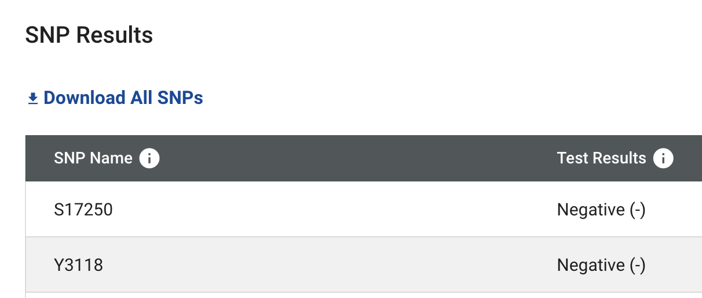
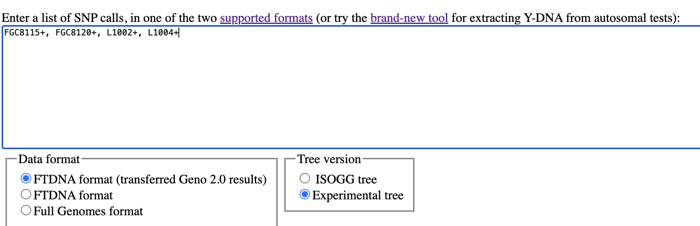
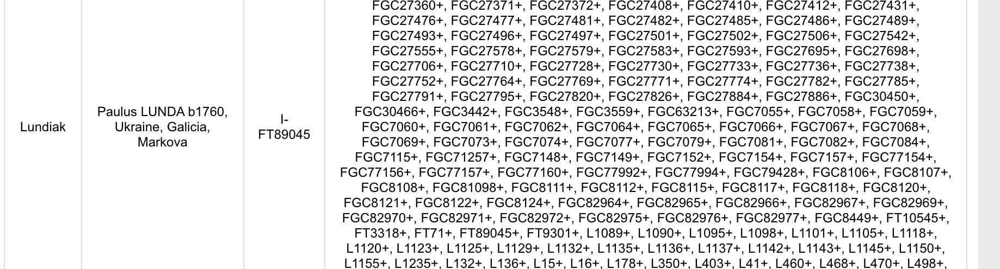

# Reformat SNPs

This is a script to re-format SNP Results from downloaded `*.CSV` from FamilyTreeDNA My Y-DNA Haplotree to "compact Y-SNP state list" in `*.TXT` file. It same format as it is listed on [FamilyTreeDNA Y-DNA SNP public results page](https://www.familytreedna.com/public/I2aHapGroup?iframe=ysnp).

FamilyTreeDNA offers to download CSV file of SNP Results on [My Y-DNA Haplotree](https://www.familytreedna.com/my/y-dna-haplotree) page.




And on [Morley SNP predictor](https://ytree.morleydna.com/) it is expected different format - FamilyTreeDNA format, eg. `M343+, L21+, DF13+, DF23+, M222-`.



So I created script to re-format SNPs, so let it be here.

```sh
npm run reformatSNPs
```

And then in local `files` folder new `*.txt` file will be created, with "comma-separated list of SNPs".

Actually, I forgot that FamilyTreeDNA does have such format but on Groups/Projects pages, like [this](https://www.familytreedna.com/public/I2aHapGroup?iframe=ysnp). Example:



So my script provides identical result.

Also, this code is kinda aimed to have a place where I can update CSV file and see git diff among old and new SNPs.

## About formats

This example of Full Genomes SNP list format:

```csv
SNP,Result,TestType
M269,+,M269
P310,-,P310
L21,+,L21

...
```

FTDNA Y-SNP haplogroup result export — a SNP status report:

```csv
SNP Name,Test Results,Test Type
S17250,Negative,S17250
Y3118,Negative,Y3118
CTS10228,Positive,CTS10228
Y4460,Positive,Y4460
Z17855,Negative,Z17855
S8201,Negative,S8201

...
```

Compact Y-SNP state list:

```txt
S17250-,Y3118-,CTS10228+,Y4460+,Z17855-, ...
```
